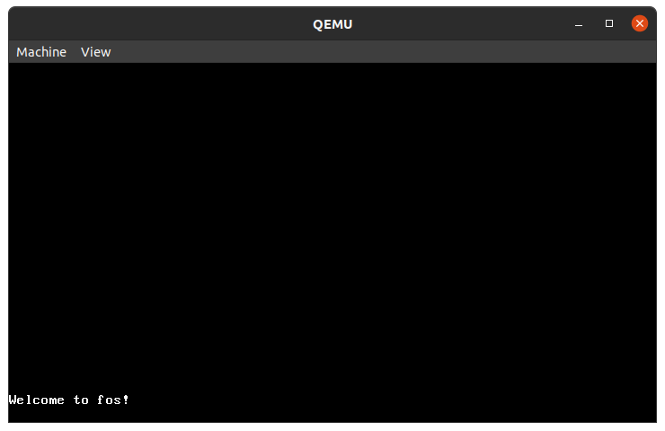

# fos
A simple operating system written in rust.

It supports:
* Paging
* Heap allocation using allocators like bump allocator, linked-list allocator and fixed-size allocator
* CPU exception handling
* Keyboard interrupts

## Boot with qemu
First build the project with cargo:
```bash
cargo build
```
Then use qemu to boot into the os:
```bash
qemu-system-x86_64 -drive format=raw,file=target/x86_64-fos/debug/bootimage-fos.bin
```


## Boot using real hardware
fos does not support UEFI so if your system uses BIOS as its firmware you can make a bootable usb using command below and then boot into the os:
```bash
dd bs=4M if=path/to/bootimage-fos.bin of=/dev/sdx status=progress oflag=sync
```
**Note:** Do not append a partition number, so do not use something like /dev/sdb1 </br>
